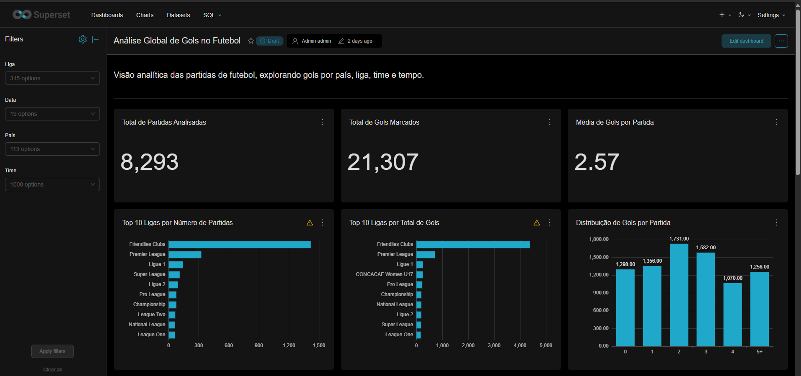
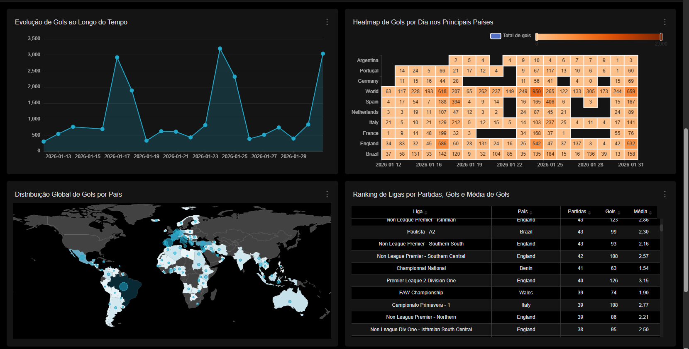
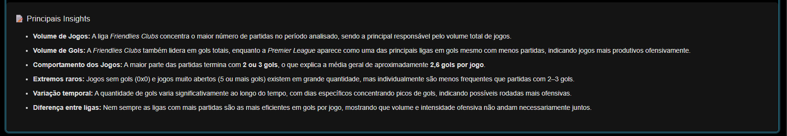
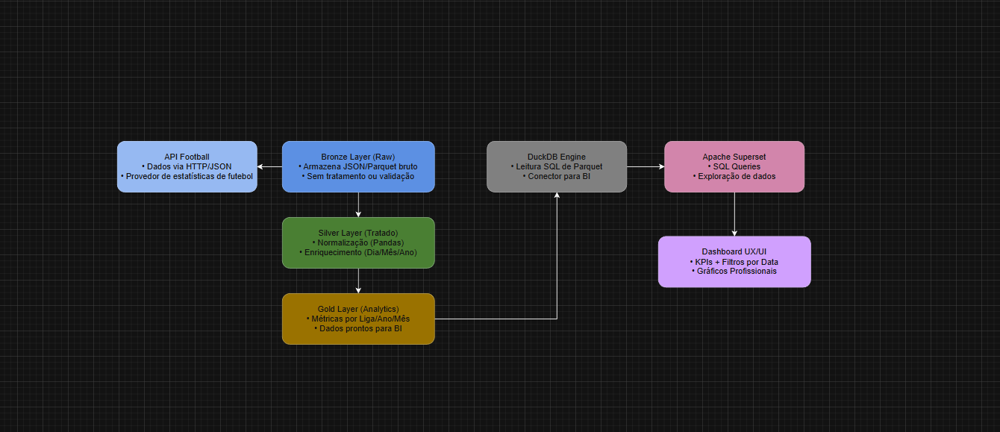

# ⚽ Football Analytics Pipeline

Pipeline de dados end-to-end para análise de partidas de futebol ao redor do mundo, com ingestão via API, arquitetura medallion (Bronze → Silver → Gold), armazenamento em DuckDB e visualização no Apache Superset.

---

## 📊 Dashboard





---

## 🏗️ Arquitetura



O pipeline segue a arquitetura **Medallion**:

| Camada | Descrição |
|--------|-----------|
| 🥉 **Bronze** | Dados brutos da API em JSON e Parquet, sem tratamento |
| 🥈 **Silver** | Dados normalizados e enriquecidos com Pandas (1 linha = 1 partida) |
| 🥇 **Gold** | Dados prontos para análise, com métricas calculadas |
| 🦆 **DuckDB** | Camada analítica com SQL, conectada ao Superset |

---

## 🛠️ Tecnologias

- **Python** — pipeline principal e transformações
- **Pandas** — normalização e enriquecimento dos dados
- **DuckDB** — banco analítico com leitura de Parquet via SQL
- **Apache Superset** — dashboards interativos
- **Docker** — ambiente isolado para o Superset
- **Parquet** — armazenamento eficiente e particionado
- **API-Football** — fonte dos dados de partidas

---

## 📁 Estrutura do Projeto

```
football-project/
│
├── pipeline_dia_anterior.py   # Pipeline principal (D-1)
├── docker-compose.yml         # Sobe o Apache Superset
├── requirements.txt           # Dependências Python
├── .env.example               # Modelo de variáveis de ambiente
│
├── 01-bronze/                 # Dados brutos (gerado pelo pipeline)
│   └── football/ano=YYYY/mes=MM/dia=DD/
│       ├── fixtures.json
│       └── fixtures.parquet
│
├── 02-silver/                 # Dados tratados (gerado pelo pipeline)
│   └── football/ano=YYYY/mes=MM/dia=DD/
│       └── silver.parquet
│
├── 03-gold/                   # Dados analíticos (gerado pelo pipeline)
│   └── football/ano=YYYY/mes=MM/dia=DD/
│       └── gold.parquet
│
└── docs/                      # Imagens do projeto
```

---

## ⚙️ Como Executar

### 1. Clone o repositório
```bash
git clone https://github.com/henriquec0889/football-project.git
cd football-project
```

### 2. Instale as dependências
```bash
pip install -r requirements.txt
```

### 3. Configure as variáveis de ambiente
```bash
cp .env.example .env
# Edite o .env e adicione sua API key da API-Football
```

### 4. Rode o pipeline
```bash
python pipeline_dia_anterior.py
```

### 5. Suba o Superset
```bash
docker-compose up -d
# Acesse: http://localhost:8088
```

---

## 📈 O que o Pipeline faz

1. **Coleta** dados do dia anterior via API-Football (REST/JSON)
2. **Salva** os dados brutos na camada Bronze (JSON + Parquet)
3. **Transforma** e normaliza na camada Silver com Pandas
4. **Agrega** métricas na camada Gold (total de gols, médias etc.)
5. **Insere** no DuckDB com idempotência (não duplica se rodar 2x)
6. Os dados ficam disponíveis no **Superset** para visualização

---

## 📊 Principais Insights do Dashboard

- Análise de **+8.000 partidas** de **315 ligas** em **113 países**
- **21.307 gols** analisados com média de **2,57 gols/partida**
- Heatmap de gols por país e por dia
- Evolução temporal dos gols
- Ranking de ligas por número de partidas e eficiência ofensiva
- Distribuição global de gols por país (mapa interativo)

---

## 👤 Autor

**Henrique Cardoso**
- LinkedIn: [linkedin.com/in/henrique-cardoso-ba816836a](https://linkedin.com/in/henrique-cardoso-ba816836a)
- GitHub: [github.com/henriquec0889](https://github.com/henriquec0889)
